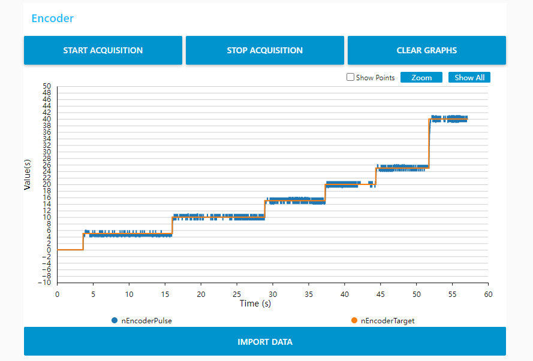

# FritzRobot_chassis
### 2023-09-25 update
McNamee's Wheel Forward and Reverse Kinematics Solved
### 2023-09-24 update
reorganize the codes, define new data type and functions to make the code more modular and readable
### 2023-09-19 update
PI control motor，Ki=3.0 and Kp=45. The control result shows like，

### 2023-09-17 update
receive formatted char from VCP and save the speed control value in float.
### 2023-09-12 update
encoder's readings sent to USB VCOM
### 2023-09-09 update
pwm and encoder must use two different TIM，problems would happen when pwm output and encoder uses different channel on the same TIM.
