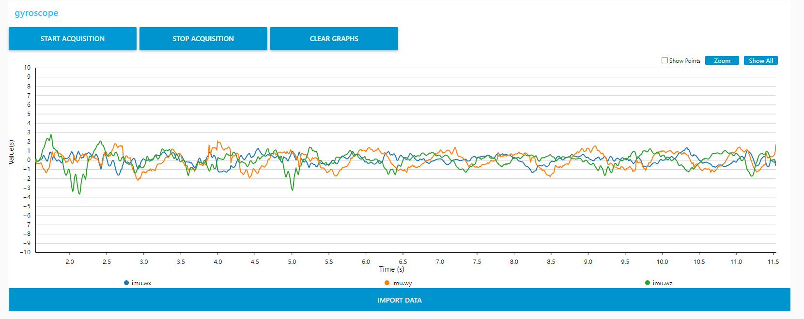

# FritzRobot_firmware
### 2023-10-14 update
switched to larger moment motor and accurater GMR encoder, therefore changed the value of ry (wheelbase) and nPpr(pulse per round).
### 2023-10-12 update
re-distribute the  GPIO pins and TIM to release the Ethernet peripheral's pins  
### 2023-10-08 update
added extended kalman filter to estimate oreientation and output the acceleration, Angular velocity and quaternion through USBVcom. The data format is shown below.

### 2023-10-05 update
added static filter to gyro's z-axis, if in 0.5s the std of z-axis<0, they imu.wz are set to 0.0, 
### 2023-10-03 update
IMU raw data sent out. The sampling rate of gyro and accel is 200hz, the DLPF for gyro and accel are both set to 92hz, the range of gyro is 250 dps, and accel is 4g.

### 2023-09-25 update
McNamee's Wheel Forward and Reverse Kinematics Solved
### 2023-09-24 update
reorganize the codes, define new data type and functions to make the code more modular and readable
### 2023-09-19 update
PI control motor，Ki=3.0 and Kp=45. The control result shows like，

### 2023-09-17 update
receive formatted char from VCP and save the speed control value in float.
### 2023-09-12 update
encoder's readings sent to USB VCOM
### 2023-09-09 update
pwm and encoder must use two different TIM，problems would happen when pwm output and encoder uses different channel on the same TIM.
